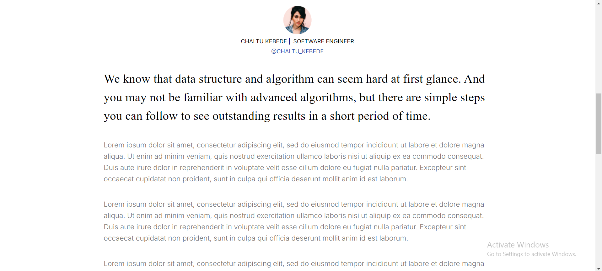

# Blog Platform

#### This project is a blog platform built with Next.js, designed to showcase and manage blog posts. The platform includes features like pagination, search functionality, and a detailed blog view with related content.

## Table of Contents

#### Features
#### Screenshots
#### Project Structure
#### Usage
#### API Reference
#### Contributing

## Features

### Pagination
#### Browse through the blog posts with a custom pagination system that displays a limited number of posts per page.

### Search
#### Filter blogs using the search bar to quickly find specific posts.

### Responsive Design
#### Optimized for both desktop and mobile devices.

### Dynamic Blog Content 
#### Each blog post includes detailed content with the author's information, tags, and an associated image.

## Screenshots

### NavBar

### Blogs Page

### Specific Blog Page

### Footer

### Responsiveness

## Project Structure

├── components
│   ├── NavBar
│   ├── Card
│   ├── Footer
│   ├── RelatedCard
├── pages
│   ├── page.tsx
│   └── blog
│       ├── [id].tsx
│           └── page.tsx
├── public
│   ├── images
│   └── assets
└── styles
    ├── globals.css
    └── tailwind.css

## Key Components

### NavBar
#### The navigation bar at the top of the page, linking to various sections of the website.

### Card
#### A component used to display individual blog posts in a card layout.

### Footer 
#### The footer of the page, containing links and social media icons.

### RelatedCard
#### A component that shows related blog posts.

## Usage

### Pagination
#### The blog platform uses pagination to display a fixed number of blogs per page. The pagination buttons are dynamically generated based on the number of blog posts available.

### Search Functionality
#### You can search for specific blog posts using the search bar at the top of the blog listing page.

### View Blog Post
#### Click on any blog card to navigate to the detailed view of the blog post, where you'll find the full content, author information, and related posts.

## API Reference

#### The project fetches blog data from an API. The following endpoints are used:

### GET /api/blogs
#### Fetches the list of all blog posts.

### GET /api/blogs/
#### Fetches the detailed information for a single blog post.

### Each API request requires a Bearer token for authorization.

## Contributing
### Contributions are welcome! Please follow these steps to contribute:

#### Fork the repository.
#### Create a new branch (git checkout -b feature-branch).
#### Make your changes.
#### Commit your changes (git commit -m 'Add some feature').
#### Push to the branch (git push origin feature-branch).
#### Open a pull request.